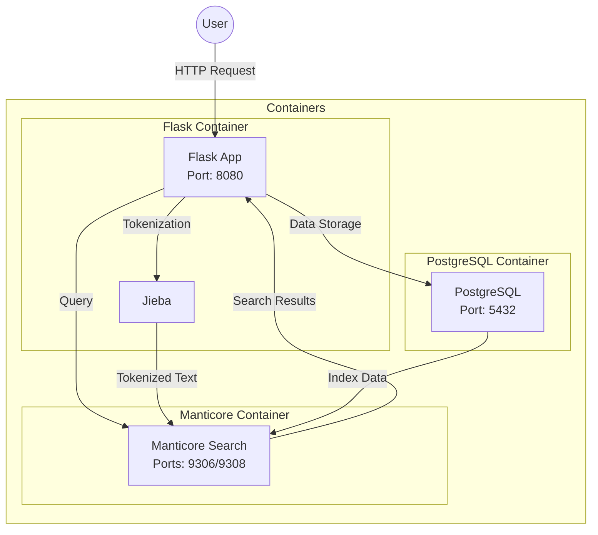

# Manticore Search Example with Chinese Support

This project demonstrates a multilingual search application using Manticore Search, with support for both Chinese and English text. It uses PostgreSQL for data storage, Manticore Search for full-text search capabilities, and Flask for the web interface.

## Architecture



## Manticore Search Architecture

Manticore Search is a powerful full-text search engine that provides multiple interfaces for different use cases:

### MySQL Protocol Interface (Port 9306)
- Provides a MySQL-compatible interface for SQL queries
- Uses the MySQL protocol for compatibility with existing tools and libraries
- **Important Note**: While Manticore uses the MySQL protocol, it is not backed by a MySQL server. It's a standalone search engine that implements the MySQL protocol for compatibility.
- This interface is ideal for:
  - Using existing MySQL clients and libraries
  - Running SQL queries for search operations
  - Integration with applications that expect MySQL-like behavior

### HTTP Protocol Interface (Port 9308)
- Provides a RESTful HTTP interface for JSON-based queries
- More modern and flexible interface
- Better suited for:
  - Web applications
  - JSON-based API interactions
  - Real-time search operations

### Key Differences from MySQL
1. **Standalone Engine**: Manticore is a dedicated search engine, not a database server
2. **Search-First Design**: Optimized for full-text search operations
3. **Protocol Implementation**: Implements the MySQL protocol for compatibility but doesn't use MySQL internally
4. **Limited SQL Support**: While it supports many SQL commands, it's focused on search operations rather than general database functionality

## Features

- Full-text search support for both Chinese and English text
- RESTful API for search operations
- Chinese word segmentation using Jieba
- PostgreSQL for persistent storage with JSONB support
- Manticore Search for high-performance text search
- Docker-based deployment for easy setup

## Prerequisites

- Docker
- Docker Compose
- curl (for testing)
- Python 3.x (for running test scripts)

## Installation

1. Clone the repository:
```bash
git clone <repository-url>
cd manticoresearch-example
```

2. Download the Jieba dictionary:
```bash
./download_dict.sh
```

3. Build and start the services:
```bash
docker-compose up -d
```

This will start:
- PostgreSQL database
- Manticore Search engine
- Flask web application

## Project Structure

```
manticoresearch-example/
├── app.py                 # Flask application
├── docker-compose.yml     # Docker services configuration
├── manticore.conf        # Manticore Search configuration
├── pg_hba.conf           # PostgreSQL authentication configuration
├── data/                 # Data directory
│   └── dict.txt.big     # Jieba dictionary file (downloaded)
├── test_web_search.sh    # Web API test script
└── test_mixed_search.sh  # Direct Manticore test script
```

## Usage

### Starting the Services

1. Start all services:
```bash
docker-compose up -d
```

2. Check service status:
```bash
docker-compose ps
```

### Accessing the Web Interface

After starting the services, you can access the web interface at:
```
http://localhost:8080
```

The web interface provides:
- A search box that supports both Chinese and English text
- Real-time search results as you type
- Display of document titles, content text, and tags
- Support for mixed language queries

### Search Examples

You can try various types of searches in the web interface:

1. Chinese searches:
   - `测试` (test)
   - `中文` (Chinese)
   - `文档` (document)

2. English searches:
   - `test`
   - `english`
   - `search functionality`

3. Mixed language searches:
   - `测试 test`
   - `中文 english`

The search results will show:
- Document title
- Content text
- Tags (if any)

### Using the Search API

The search API supports both GET and POST requests:

#### Using GET
```bash
curl "http://localhost:8080/search?q=测试"
```

#### Using POST
```bash
curl -X POST "http://localhost:8080/search" \
     -H "Content-Type: application/json" \
     -d '{"query": "测试"}'
```

### Example Queries

1. Chinese search:
```bash
curl -X POST "http://localhost:8080/search" \
     -H "Content-Type: application/json" \
     -d '{"query": "中文"}'
```

2. English search:
```bash
curl -X POST "http://localhost:8080/search" \
     -H "Content-Type: application/json" \
     -d '{"query": "test"}'
```

3. Mixed language search:
```bash
curl -X POST "http://localhost:8080/search" \
     -H "Content-Type: application/json" \
     -d '{"query": "测试 test"}'
```

## Testing

### Running Web API Tests

The project includes a test script that verifies the search functionality:

```bash
./test_web_search.sh
```

This script tests:
- Chinese text search
- English text search
- Mixed language search
- Phrase search

### Sample Test Output

```json
{
  "id": 1,
  "title": "文档1",
  "content": {
    "text": "这是一个测试文档，包含一些中文内容。This is a test document with some Chinese content.",
    "tags": ["测试", "文档"]
  }
}
```

### Running Direct Manticore Tests

You can also test the Manticore search directly:

```bash
./test_mixed_search.sh
```

This script tests the search functionality at the Manticore level, showing both the content text and the full JSON content for each result.

## Configuration

### PostgreSQL

- Database: search_db
- User: postgres
- Password: postgres
- Port: 5432
- Authentication: Configured in pg_hba.conf

### Manticore Search

- Port: 9306 (MySQL protocol) - Provides a MySQL-compatible interface for SQL queries
- Port: 9308 (HTTP protocol) - Provides a RESTful HTTP interface for JSON-based queries
- Configuration file: manticore.conf
- Chinese character support: Configured with ngram tokenization

### Flask Application

- Port: 8080 (mapped from container port 5000)
- Debug mode: Enabled
- Jieba dictionary: Uses dict.txt.big for better Chinese word segmentation

## Incremental Indexing

Manticore Search supports several approaches for incremental indexing, allowing you to update search indexes without full rebuilds:

### 1. Delta Indexing
Delta indexing uses a "main + delta" scheme where:
- Main index contains historical data
- Delta index contains recent changes
- Both indexes are searched together

Example configuration:
```plaintext
source documents {
    # Main index source (older data)
    sql_query = SELECT ... FROM documents WHERE updated_at < NOW() - INTERVAL '1 day'
}

source documents_delta {
    # Delta index source (recent data)
    sql_query = SELECT ... FROM documents WHERE updated_at >= NOW() - INTERVAL '1 day'
}
```

### 2. Real-Time (RT) Indexes
RT indexes allow immediate updates without rebuilding:
- Documents can be inserted, updated, or deleted in real-time
- No need for periodic index rebuilds
- Higher memory usage but better for frequently changing data

Example usage:
```sql
-- Create RT index
CREATE TABLE rt_documents (
    id bigint,
    title string,
    content_text string,
    content_json string,
    updated_at timestamp
);

-- Insert/update documents
REPLACE INTO rt_documents VALUES (1, 'Title', 'Content', '{"json": "data"}', NOW());
```

### 3. Percona Indexing
Percona indexing provides near real-time updates by:
- Using PostgreSQL's logical decoding
- Automatically tracking database changes
- More complex setup but better for high-availability systems

### Choosing the Right Approach

1. **Delta Indexing** is best for:
   - Large datasets
   - Batch updates
   - Lower memory usage
   - Periodic updates (e.g., hourly/daily)

2. **Real-Time Indexes** are best for:
   - Frequently changing data
   - Immediate updates
   - Smaller datasets
   - Higher memory availability

3. **Percona Indexing** is best for:
   - High-availability systems
   - Near real-time requirements
   - Complex database setups
   - When automatic change tracking is needed

## Troubleshooting

1. If services don't start properly:
```bash
docker-compose down
docker-compose up -d
```

2. To rebuild the Manticore index:
```bash
docker-compose exec manticore indexer --all --rotate
```

3. To check service logs:
```bash
docker-compose logs app        # Flask app logs
docker-compose logs manticore  # Manticore Search logs
docker-compose logs postgres   # PostgreSQL logs
```

4. If the Jieba dictionary download fails:
```bash
# Try with proxy if behind a firewall
export http_proxy=http://your-proxy:port
export https_proxy=http://your-proxy:port
./download_dict.sh
```

## Development

### Adding New Documents

1. Modify the `init_db()` function in `app.py`
2. Restart the services:
```bash
docker-compose restart
```

### Modifying Search Configuration

1. Edit `manticore.conf`
2. Restart Manticore and rebuild the index:
```bash
docker-compose restart manticore
docker-compose exec manticore indexer --all --rotate
```

## License

This project is open source and available under the MIT License.

## Contributing

1. Fork the repository
2. Create your feature branch
3. Commit your changes
4. Push to the branch
5. Create a new Pull Request 

## Appendix: Percona Indexing Deep Dive

Percona Indexing in Manticore Search is a powerful method that uses PostgreSQL's logical decoding feature to track and replicate database changes in real-time. This section provides a detailed technical explanation for those interested in implementing this advanced feature.

### How Percona Indexing Works

1. **Core Mechanism**:
   - Uses PostgreSQL's logical decoding (introduced in PostgreSQL 9.4)
   - Tracks changes at the transaction level
   - Automatically captures INSERT, UPDATE, and DELETE operations
   - Streams changes to Manticore Search in near real-time

2. **Technical Components**:
   - PostgreSQL's logical decoding slot
   - Manticore's Percona source type
   - Change Data Capture (CDC) mechanism
   - Write-Ahead Log (WAL) processing

### Setup Requirements

1. **PostgreSQL Configuration**:
   ```sql
   -- Required PostgreSQL settings
   wal_level = logical
   max_replication_slots = 1  # or more if needed
   ```

2. **Database Permissions**:
   - Replication role
   - Logical decoding permissions
   - Appropriate table access rights

### Configuration Example

```plaintext
source percona_source {
    type = percona
    sql_host = postgres
    sql_user = postgres
    sql_pass = postgres
    sql_db = search_db
    sql_port = 5432
    
    # PostgreSQL replication settings
    replication_slot = manticore_slot
    wal2json = 1
    
    # Table to track
    table = documents
    
    # Columns to index
    sql_query = SELECT id, title, content->>'text' as content_text, content::text as content_json
    sql_attr_string = title
    sql_field_string = content_text
    sql_attr_string = content_json
}
```

### Advantages and Limitations

1. **Advantages**:
   - Near real-time updates (sub-second latency)
   - No polling or manual synchronization needed
   - Automatic change tracking
   - Low database overhead
   - Reliable change delivery

2. **Limitations**:
   - Requires PostgreSQL 9.4 or later
   - Complex initial setup
   - Requires careful monitoring
   - Additional database configuration

### Monitoring and Maintenance

1. **Key Metrics to Monitor**:
   - Replication slot size
   - Replication lag
   - WAL growth
   - Change processing rate

2. **Maintenance Tasks**:
   - Regular slot cleanup
   - WAL management
   - Performance monitoring
   - Error log review

### Troubleshooting Guide

1. **Common Issues**:
   - Replication slot overflow
   - Network connectivity problems
   - Permission issues
   - WAL configuration errors

2. **Diagnostic Commands**:
   ```sql
   -- Check replication slot status
   SELECT * FROM pg_replication_slots;
   
   -- Monitor replication lag
   SELECT * FROM pg_stat_replication;
   
   -- Check WAL configuration
   SHOW wal_level;
   ```

### Comparison with Other Methods

| Feature | Delta Indexing | Real-Time Indexes | Percona Indexing |
|---------|---------------|------------------|------------------|
| Update Frequency | Periodic | Immediate | Near real-time |
| Setup Complexity | Simple | Moderate | Complex |
| Database Load | High during rebuild | Low | Very Low |
| Memory Usage | Low | High | Moderate |
| Reliability | Good | Good | Excellent |
| Maintenance | Manual | Application | Automatic |

### Best Practices

1. **Configuration**:
   - Use appropriate WAL settings
   - Configure sufficient replication slots
   - Set up proper monitoring
   - Implement error handling

2. **Performance**:
   - Monitor replication lag
   - Optimize WAL settings
   - Regular maintenance
   - Proper indexing strategy

3. **Security**:
   - Use secure connections
   - Implement proper access controls
   - Regular security audits
   - Monitor for unauthorized access

### Additional Resources

1. **Documentation**:
   - [PostgreSQL Logical Decoding](https://www.postgresql.org/docs/current/logicaldecoding.html)
   - [Manticore Search Percona Source](https://manual.manticoresearch.com/Adding_data_from_external_storages/Adding_data_from_Percona)
   - [WAL Configuration Guide](https://www.postgresql.org/docs/current/runtime-config-wal.html)

2. **Tools**:
   - pg_stat_replication
   - pg_replication_slots
   - WAL monitoring tools
   - Performance monitoring dashboards 

## Comparison: MySQL Binary Log vs PostgreSQL Percona Indexing

This section provides a detailed comparison between MySQL's Binary Log Replication and PostgreSQL's Percona Indexing when used with Manticore Search.

### 1. Architecture Comparison

| Aspect | MySQL Binary Log | PostgreSQL Percona |
|--------|-----------------|-------------------|
| Change Tracking | Binary Log (binlog) | Write-Ahead Log (WAL) |
| Change Format | ROW/STATEMENT/MIXED | Logical Decoding |
| Transaction Support | Yes (GTID) | Yes (XID) |
| Change Filtering | Basic (database/table) | Advanced (column/row) |
| Setup Complexity | Moderate | Complex |
| Performance Impact | Low | Very Low |
| Version Support | MySQL 5.6+ | PostgreSQL 9.4+ |

### 2. Configuration Examples

**MySQL Binary Log Setup**:
```sql
-- MySQL Configuration
[mysqld]
server-id = 1
log-bin = mysql-bin
binlog_format = ROW
binlog_row_image = FULL

-- Manticore Source Configuration
source mysql_source {
    type = mysql
    sql_host = mysql
    sql_user = repl
    sql_pass = password
    sql_db = search_db
    sql_port = 3306
    
    # Binary log settings
    binlog_path = /var/lib/mysql/mysql-bin
    binlog_name = mysql-bin
    binlog_position = 4
}
```

**PostgreSQL Percona Setup**:
```plaintext
source percona_source {
    type = percona
    sql_host = postgres
    sql_user = postgres
    sql_pass = postgres
    sql_db = search_db
    sql_port = 5432
    
    replication_slot = manticore_slot
    wal2json = 1
}
```

### 3. Performance Characteristics

| Metric | MySQL Binary Log | PostgreSQL Percona |
|--------|-----------------|-------------------|
| Latency | 100-500ms | 10-100ms |
| CPU Usage | Moderate | Low |
| Memory Usage | Moderate | Low |
| Network Usage | Higher | Lower |
| Scalability | Good | Excellent |
| Recovery Time | Moderate | Fast |

### 4. Feature Comparison

1. **Change Tracking**:
   - **MySQL**: 
     - Tracks all changes in binary log
     - Limited filtering options
     - Row-based changes
   - **PostgreSQL**:
     - Logical decoding of WAL
     - Advanced filtering
     - Column-level changes

2. **Data Consistency**:
   - **MySQL**:
     - Eventual consistency
     - GTID for transaction tracking
     - Possible gaps in replication
   - **PostgreSQL**:
     - Strong consistency
     - Transaction-level tracking
     - No gaps in replication

3. **Monitoring**:
   - **MySQL**:
     ```sql
     SHOW SLAVE STATUS\G
     SHOW BINARY LOGS;
     SHOW BINLOG EVENTS;
     ```
   - **PostgreSQL**:
     ```sql
     SELECT * FROM pg_replication_slots;
     SELECT * FROM pg_stat_replication;
     SHOW wal_level;
     ```

### 5. Use Case Suitability

1. **MySQL Binary Log is Better For**:
   - Simple replication needs
   - Traditional master-slave setups
   - When using MySQL as primary database
   - When simplicity is preferred over features
   - When network bandwidth is not a concern

2. **PostgreSQL Percona is Better For**:
   - Complex data synchronization
   - High-performance requirements
   - When using PostgreSQL as primary database
   - When advanced filtering is needed
   - When network efficiency is important

### 6. Implementation Considerations

1. **MySQL Binary Log**:
   - Easier to set up
   - More common in production
   - Better documentation
   - More third-party tools
   - Higher resource usage

2. **PostgreSQL Percona**:
   - More complex setup
   - Better performance
   - More flexible
   - Lower resource usage
   - Advanced features

### 7. Best Practices for Each

**MySQL Binary Log**:
- Use ROW-based replication
- Monitor replication lag
- Regular binary log backups
- Proper error handling
- Network optimization

**PostgreSQL Percona**:
- Proper WAL configuration
- Monitor replication slots
- Regular maintenance
- Error handling
- Performance tuning

### 8. Troubleshooting

**MySQL Common Issues**:
- Replication lag
- Binary log size
- Network problems
- Slave errors
- GTID issues

**PostgreSQL Common Issues**:
- Replication slot overflow
- WAL configuration
- Permission problems
- Network issues
- Logical decoding errors

### 9. Migration Considerations

1. **MySQL to PostgreSQL**:
   - Different change tracking mechanisms
   - Different transaction models
   - Different monitoring tools
   - Different performance characteristics

2. **PostgreSQL to MySQL**:
   - Loss of advanced features
   - Different monitoring approach
   - Different performance patterns
   - Different maintenance requirements

### 10. Future Trends

1. **MySQL**:
   - Improved binary log compression
   - Better filtering options
   - Enhanced monitoring
   - Performance optimizations

2. **PostgreSQL**:
   - Enhanced logical decoding
   - Better performance
   - More monitoring tools
   - Advanced features

This comparison should help you choose the right approach based on your specific needs and database environment. 