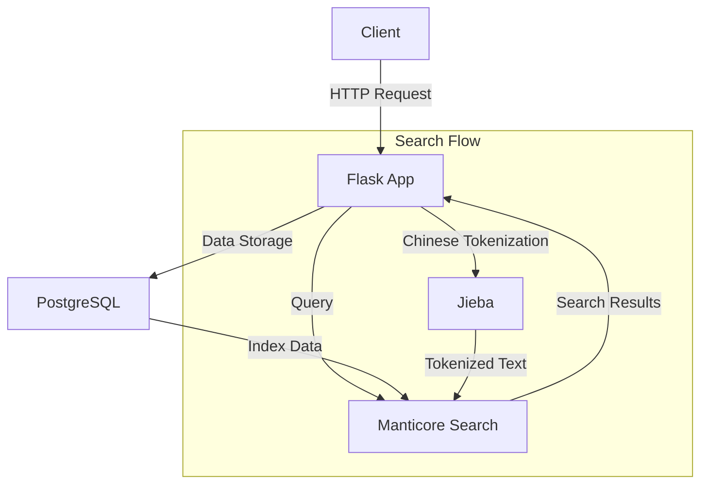

# Manticore Search Example with Chinese Support

This project demonstrates a multilingual search application using Manticore Search, with support for both Chinese and English text. It uses PostgreSQL for data storage, Manticore Search for full-text search capabilities, and Flask for the web interface.

## Architecture



## Features

- Full-text search support for both Chinese and English text
- RESTful API for search operations
- Chinese word segmentation using Jieba
- PostgreSQL for persistent storage with JSONB support
- Manticore Search for high-performance text search
- Docker-based deployment for easy setup

## Prerequisites

- Docker
- Docker Compose
- curl (for testing)
- Python 3.x (for running test scripts)

## Installation

1. Clone the repository:
```bash
git clone <repository-url>
cd manticoresearch-example
```

2. Make scripts executable:
```bash
chmod +x *.sh
```

3. Download the Jieba dictionary:
```bash
./download_dict.sh
```

4. Build and start the services:
```bash
docker-compose up -d
```

This will start:
- PostgreSQL database
- Manticore Search engine
- Flask web application

## Project Structure

```
manticoresearch-example/
├── app.py                 # Flask application
├── docker-compose.yml     # Docker services configuration
├── manticore.conf        # Manticore Search configuration
├── pg_hba.conf           # PostgreSQL authentication configuration
├── data/                 # Data directory
│   └── dict.txt.big     # Jieba dictionary file (downloaded)
├── test_web_search.sh    # Web API test script
└── test_mixed_search.sh  # Direct Manticore test script
```

## Usage

### Starting the Services

1. Start all services:
```bash
docker-compose up -d
```

2. Check service status:
```bash
docker-compose ps
```

### Using the Search API

The search API supports both GET and POST requests:

#### Using GET
```bash
curl "http://localhost:6000/search?q=测试"
```

#### Using POST
```bash
curl -X POST "http://localhost:6000/search" \
     -H "Content-Type: application/json" \
     -d '{"query": "测试"}'
```

### Example Queries

1. Chinese search:
```bash
curl -X POST "http://localhost:6000/search" \
     -H "Content-Type: application/json" \
     -d '{"query": "中文"}'
```

2. English search:
```bash
curl -X POST "http://localhost:6000/search" \
     -H "Content-Type: application/json" \
     -d '{"query": "test"}'
```

3. Mixed language search:
```bash
curl -X POST "http://localhost:6000/search" \
     -H "Content-Type: application/json" \
     -d '{"query": "测试 test"}'
```

## Testing

### Running Web API Tests

The project includes a test script that verifies the search functionality:

```bash
./test_web_search.sh
```

This script tests:
- Chinese text search
- English text search
- Mixed language search
- Phrase search

### Sample Test Output

```json
{
  "content": "这是一个测试文档，包含一些中文内容。This is a test document with some Chinese content.",
  "id": 1,
  "title": "文档1"
}
```

## Configuration

### PostgreSQL

- Database: search_db
- User: postgres
- Password: postgres
- Port: 5432
- Authentication: Configured in pg_hba.conf

### Manticore Search

- Port: 9306 (MySQL protocol)
- Port: 9308 (HTTP protocol)
- Configuration file: manticore.conf
- Chinese character support: Configured with ngram tokenization

### Flask Application

- Port: 6000 (mapped from container port 5000)
- Debug mode: Enabled
- Jieba dictionary: Uses dict.txt.big for better Chinese word segmentation

## Troubleshooting

1. If services don't start properly:
```bash
docker-compose down
docker-compose up -d
```

2. To rebuild the Manticore index:
```bash
docker-compose exec manticore indexer --all --rotate
```

3. To check service logs:
```bash
docker-compose logs app        # Flask app logs
docker-compose logs manticore  # Manticore Search logs
docker-compose logs postgres   # PostgreSQL logs
```

4. If the Jieba dictionary download fails:
```bash
# Try with proxy if behind a firewall
export http_proxy=http://your-proxy:port
export https_proxy=http://your-proxy:port
./download_dict.sh
```

## Development

### Adding New Documents

1. Modify the `init_db()` function in `app.py`
2. Restart the services:
```bash
docker-compose restart
```

### Modifying Search Configuration

1. Edit `manticore.conf`
2. Restart Manticore and rebuild the index:
```bash
docker-compose restart manticore
docker-compose exec manticore indexer --all --rotate
```

## License

This project is open source and available under the MIT License.

## Contributing

1. Fork the repository
2. Create your feature branch
3. Commit your changes
4. Push to the branch
5. Create a new Pull Request 