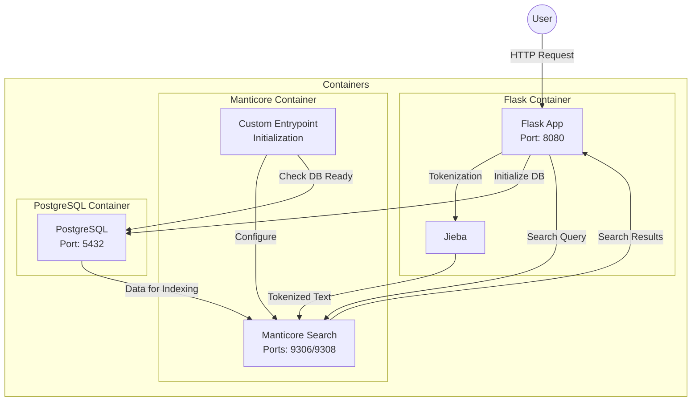

# Manticore Search Example with Chinese Support

This project demonstrates a multilingual search application using Manticore Search, with support for both Chinese and English text. It uses PostgreSQL for data storage, Manticore Search for full-text search capabilities, and Flask for the web interface.

## Architecture



## Manticore Search Architecture

Manticore Search is a powerful full-text search engine that provides multiple interfaces for different use cases:

### MySQL Protocol Interface (Port 9306)
- Provides a MySQL-compatible interface for SQL queries
- Uses the MySQL protocol for compatibility with existing tools and libraries
- **Important Note**: While Manticore uses the MySQL protocol, it is not backed by a MySQL server. It's a standalone search engine that implements the MySQL protocol for compatibility.
- This interface is ideal for:
  - Using existing MySQL clients and libraries
  - Running SQL queries for search operations
  - Integration with applications that expect MySQL-like behavior

### HTTP Protocol Interface (Port 9308)
- Provides a RESTful HTTP interface for JSON-based queries
- More modern and flexible interface
- Better suited for:
  - Web applications
  - JSON-based API interactions
  - Real-time search operations

### Key Differences from MySQL
1. **Standalone Engine**: Manticore is a dedicated search engine, not a database server
2. **Search-First Design**: Optimized for full-text search operations
3. **Protocol Implementation**: Implements the MySQL protocol for compatibility but doesn't use MySQL internally
4. **Limited SQL Support**: While it supports many SQL commands, it's focused on search operations rather than general database functionality

## Features

- Full-text search support for both Chinese and English text
- RESTful API for search operations
- Chinese word segmentation using Jieba
- PostgreSQL for persistent storage with JSONB support
- Manticore Search for high-performance text search
- Docker-based deployment for easy setup

## Prerequisites

- Docker
- Docker Compose
- curl (for testing)
- Python 3.x (for running test scripts)

## Step-by-Step Setup

1. **Clone and Prepare the Repository**:
```bash
git clone <repository-url>
cd manticoresearch-example
```

2. **Download Required Dependencies**:
```bash
# Download Jieba dictionary
./download_dict.sh

# If behind a firewall, use proxy:
export http_proxy=http://localhost:7890 https_proxy=http://localhost:7890
./download_dict.sh
```

3. **Build and Start Services**:
```bash
# Clean up any existing containers and volumes
docker-compose down -v

# Build and start services with proxy settings
export http_proxy=http://localhost:7890 https_proxy=http://localhost:7890
docker-compose build
docker-compose up -d
```

4. **Monitor Service Startup**:
```bash
# Check service status
docker-compose ps

# Monitor logs
docker-compose logs -f
```

The services will start in this order:
1. PostgreSQL starts and becomes healthy
2. Flask app initializes the database with sample data
3. Manticore waits for the database to be ready and creates the search index

5. **Verify Setup**:
```bash
# Check if all services are running
docker-compose ps

# Expected output:
# manticoresearch-example-postgres-1 (healthy)
# manticoresearch-example-manticore-1 (running)
# manticoresearch-example-app-1 (running)
```

6. **Test the Setup**:
```bash
# Test web search functionality
curl -X POST "http://localhost:8080/search" \
     -H "Content-Type: application/json" \
     -d '{"query": "测试"}'

# Test mixed language search
curl -X POST "http://localhost:8080/search" \
     -H "Content-Type: application/json" \
     -d '{"query": "测试 test"}'
```

7. **Troubleshooting**:
If you encounter any issues:
```bash
# Check service logs
docker-compose logs app        # Flask app logs
docker-compose logs manticore  # Manticore Search logs
docker-compose logs postgres   # PostgreSQL logs

# Rebuild Manticore index if needed
docker-compose exec manticore indexer --all --rotate

# Restart services if needed
docker-compose restart
```

## Project Structure

```
manticoresearch-example/
├── app.py                 # Flask application
├── docker-compose.yml     # Docker services configuration
├── manticore.conf        # Manticore Search configuration
├── pg_hba.conf           # PostgreSQL authentication configuration
├── Dockerfile.manticore  # Custom Manticore image with PostgreSQL client
├── docker-entrypoint.sh  # Manticore initialization script
├── requirements.txt      # Python dependencies
└── data/                 # Data directory
    └── dict.txt.big     # Jieba Chinese dictionary
```

## Usage

### Starting the Services

1. Start all services:
```bash
docker-compose up -d
```

2. Check service status:
```bash
docker-compose ps
```

### Accessing the Web Interface

After starting the services, you can access the web interface at:
```
http://localhost:8080
```

The web interface provides:
- A search box that supports both Chinese and English text
- Real-time search results as you type
- Display of document titles, content text, and tags
- Support for mixed language queries

### Search Examples

You can try various types of searches in the web interface:

1. Chinese searches:
   - `测试` (test)
   - `中文` (Chinese)
   - `文档` (document)

2. English searches:
   - `test`
   - `english`
   - `search functionality`

3. Mixed language searches:
   - `测试 test`
   - `中文 english`

The search results will show:
- Document title
- Content text
- Tags (if any)

### Using the Search API

The search API supports both GET and POST requests:

#### Using GET
```bash
curl "http://localhost:8080/search?q=测试"
```

#### Using POST
```bash
curl -X POST "http://localhost:8080/search" \
     -H "Content-Type: application/json" \
     -d '{"query": "测试"}'
```

### Example Queries

1. Chinese search:
```bash
curl -X POST "http://localhost:8080/search" \
     -H "Content-Type: application/json" \
     -d '{"query": "中文"}'
```

2. English search:
```bash
curl -X POST "http://localhost:8080/search" \
     -H "Content-Type: application/json" \
     -d '{"query": "test"}'
```

3. Mixed language search:
```bash
curl -X POST "http://localhost:8080/search" \
     -H "Content-Type: application/json" \
     -d '{"query": "测试 test"}'
```

## Testing

The project includes two test scripts to verify the functionality:

1. Web Search Tests (`test_web_search.sh`):
   - Tests the Flask API endpoints
   - Verifies Chinese and English text search
   - Tests mixed language search
   - Uses curl to make HTTP requests

2. Direct Manticore Tests (`test_mixed_search.sh`):
   - Tests Manticore Search directly via MySQL protocol
   - Verifies index structure and content
   - Tests search functionality at the engine level
   - Uses MySQL client to connect to Manticore

To run the tests:
```bash
# Make the test scripts executable
chmod +x test_web_search.sh test_mixed_search.sh

# Run web search tests
./test_web_search.sh

# Run direct Manticore tests
./test_mixed_search.sh
```

## Configuration

### PostgreSQL

- Database: search_db
- User: postgres
- Password: postgres
- Port: 5432
- Authentication: Configured in pg_hba.conf

### Manticore Search

- Port: 9306 (MySQL protocol) - Provides a MySQL-compatible interface for SQL queries
- Port: 9308 (HTTP protocol) - Provides a RESTful HTTP interface for JSON-based queries
- Configuration file: manticore.conf
- Chinese character support: Configured with ngram tokenization

### Flask Application

- Port: 8080 (mapped from container port 5000)
- Debug mode: Enabled
- Jieba dictionary: Uses dict.txt.big for better Chinese word segmentation

## Troubleshooting

1. If services don't start properly:
```bash
docker-compose down
docker-compose up -d
```

2. To rebuild the Manticore index:
```bash
docker-compose exec manticore indexer --all --rotate
```

3. To check service logs:
```bash
docker-compose logs app        # Flask app logs
docker-compose logs manticore  # Manticore Search logs
docker-compose logs postgres   # PostgreSQL logs
```

4. If the Jieba dictionary download fails:
```bash
# Try with proxy if behind a firewall
export http_proxy=http://your-proxy:port
export https_proxy=http://your-proxy:port
./download_dict.sh
```

## Development

### Adding New Documents

1. Modify the `init_db()` function in `app.py`
2. Restart the services:
```bash
docker-compose restart
```

### Modifying Search Configuration

1. Edit `manticore.conf`
2. Restart Manticore and rebuild the index:
```bash
docker-compose restart manticore
docker-compose exec manticore indexer --all --rotate
```

## License

This project is open source and available under the MIT License.

## Contributing

1. Fork the repository
2. Create your feature branch
3. Commit your changes
4. Push to the branch
5. Create a new Pull Request 

## Appendix

### 1. Incremental Indexing Deep Dive

Manticore Search supports several approaches for incremental indexing, allowing you to update search indexes without full rebuilds. This section provides a detailed technical explanation of each approach.

#### Delta Indexing
Delta indexing uses a "main + delta" scheme where:
- Main index contains historical data
- Delta index contains recent changes
- Both indexes are searched together

**Technical Implementation**:
1. **Tracking Table Setup**:
```sql
-- Create tracking table in PostgreSQL
CREATE TABLE index_tracking (
    index_name VARCHAR(50) PRIMARY KEY,
    last_update TIMESTAMP NOT NULL
);

-- Initial entry for delta index
INSERT INTO index_tracking (index_name, last_update)
VALUES ('documents_delta', NOW() - INTERVAL '15 minutes');
```

2. **Main Index Configuration**:
```plaintext
source documents {
    # Main index source (historical data)
    sql_query = SELECT id, title, content->>'text' as content_text, content::text as content_json, updated_at \
                FROM documents \
                WHERE updated_at < (SELECT last_update FROM index_tracking WHERE index_name = 'documents_delta')
    
    # Index configuration
    sql_attr_timestamp = updated_at
    sql_field_string = content_text
    sql_attr_string = content_json
}
```

3. **Delta Index Configuration**:
```plaintext
source documents_delta {
    # Delta index source (recent changes)
    sql_query = SELECT id, title, content->>'text' as content_text, content::text as content_json, updated_at \
                FROM documents \
                WHERE updated_at >= (SELECT last_update FROM index_tracking WHERE index_name = 'documents_delta')
    
    # Update tracking after indexing
    sql_query_post = UPDATE index_tracking \
                     SET last_update = NOW() \
                     WHERE index_name = 'documents_delta'
    
    # Same configuration as main index
    sql_attr_timestamp = updated_at
    sql_field_string = content_text
    sql_attr_string = content_json
}
```

4. **Crontab Configuration**:
```bash
# Edit crontab
crontab -e

# Add the following entries:
# Delta index updates (every 15 minutes)
# Using a lock file to prevent overlapping updates
*/15 * * * * /usr/bin/flock -n /tmp/manticore_delta.lock /usr/bin/indexer --config /etc/manticoresearch/manticore.conf delta_index --rotate

# Delta to main index merge (daily at 2 AM)
# Using a lock file to prevent conflicts with delta updates
0 2 * * * /usr/bin/flock -n /tmp/manticore_merge.lock /usr/bin/indexer --config /etc/manticoresearch/manticore.conf --merge main_index delta_index --rotate

# Index optimization (weekly on Sunday at 3 AM)
0 3 * * 0 /usr/bin/indexer --config /etc/manticoresearch/manticore.conf --optimize main_index

# Log rotation (daily at 1 AM)
0 1 * * * /usr/bin/find /var/log/manticore/ -name "*.log" -mtime +7 -delete
```

This configuration:
1. Uses a tracking table to record the last update time
2. Delta index only gets documents updated since last run
3. Main index gets all documents before last delta update
4. Automatically updates tracking after each delta index run

**Important Notes**:
1. The tracking mechanism ensures:
   - No documents are missed
   - No duplicate processing
   - Clean 15-minute windows
2. Lock files prevent:
   - Overlapping delta updates
   - Merge operations during updates
3. The schedule provides:
   - Near real-time updates (15-minute intervals)
   - Daily consolidation through merging
   - Weekly optimization
   - Regular log maintenance

3. **Index Merging**:
- Delta index is periodically merged into main index
- Merging can be scheduled or triggered manually
- During merge, both indexes remain searchable

**Merge Process Details**:
1. **Merge Process Overview**:
   - The merge operation combines the delta index into the main index
   - During the merge, both indexes remain searchable
   - The merge is typically triggered by the `indexer` tool

2. **Merge Commands**:
   ```bash
   # Manual merge command
   indexer --merge main_index delta_index --rotate
   ```
   The `--rotate` flag ensures the new merged index is atomically swapped with the old one.

3. **Merge Steps**:
   - Manticore creates a new index that combines both main and delta data
   - The merge is done in a way that preserves document IDs and attributes
   - Once the merge is complete, the new index replaces the old one
   - The delta index is then cleared and ready for new updates

4. **Scheduling Merges**:
   - Can be scheduled using cron jobs
   - Example cron schedule for daily merges:
   ```bash
   0 2 * * * /usr/bin/indexer --merge main_index delta_index --rotate
   ```

5. **Important Considerations**:
   - Merge operations can be resource-intensive
   - During merge, both indexes are still searchable
   - The merge is atomic - either completely succeeds or fails
   - Disk space is required for both the old and new indexes during merge

**Complete Delta Indexing Setup Plan**:

1. **Initial Setup**:
```bash
# Create main index (only rebuild main index, not delta)
indexer --config /etc/manticoresearch/manticore.conf main_index

# Create delta index
indexer --config /etc/manticoresearch/manticore.conf delta_index

# Note: Using --all would rebuild both indexes, which is not recommended
# as it would lose any recent changes in the delta index
```

2. **Crontab Configuration**:
```bash
# Edit crontab
crontab -e

# Add the following entries:
# Delta index updates (every 15 minutes)
# Using a longer interval to avoid conflicts with merge
*/15 * * * * /usr/bin/indexer --config /etc/manticoresearch/manticore.conf delta_index --rotate

# Delta to main index merge (daily at 2 AM)
# Using a lock file to prevent conflicts with delta updates
0 2 * * * /usr/bin/flock -n /tmp/manticore_merge.lock /usr/bin/indexer --config /etc/manticoresearch/manticore.conf --merge main_index delta_index --rotate

# Index optimization (weekly on Sunday at 3 AM)
0 3 * * 0 /usr/bin/indexer --config /etc/manticoresearch/manticore.conf --optimize main_index

# Log rotation (daily at 1 AM)
0 1 * * * /usr/bin/find /var/log/manticore/ -name "*.log" -mtime +7 -delete
```

The schedule is designed to:
1. Update delta index every 15 minutes (less frequent to avoid conflicts)
2. Merge delta into main index daily at 2 AM (with lock file to prevent conflicts)
3. Optimize main index weekly (Sunday 3 AM)
4. Rotate logs daily (1 AM)

This configuration ensures:
- No conflicts between delta updates and merge operations
- Simple and reliable time-based partitioning
- Efficient query performance
- Clean merge operations

**Important Notes**:
1. The 24-hour window ensures:
   - No documents are missed
   - No duplicate documents
   - Clean partitioning between main and delta
2. The lock file prevents:
   - Merge operations during delta updates
   - Multiple merge operations running simultaneously
3. The 15-minute interval for delta updates:
   - Reduces system load
   - Minimizes chance of conflicts
   - Still provides near real-time updates

3. **Monitoring Script**:
```bash
#!/bin/bash
# /usr/local/bin/check_manticore.sh

# Check if Manticore is running
if ! pgrep -x "searchd" > /dev/null; then
    echo "Manticore Search is not running!"
    exit 1
fi

# Check disk space
DISK_SPACE=$(df -h /var/lib/manticore | awk 'NR==2 {print $5}' | sed 's/%//')
if [ "$DISK_SPACE" -gt 90 ]; then
    echo "Warning: Disk space usage is above 90%"
fi

# Check index status
INDEX_STATUS=$(indexer --config /etc/manticoresearch/manticore.conf --status)
if echo "$INDEX_STATUS" | grep -q "error"; then
    echo "Error in index status!"
    exit 1
fi

# Add to crontab (every 15 minutes)
*/15 * * * * /usr/local/bin/check_manticore.sh >> /var/log/manticore/monitor.log 2>&1
```

4. **Backup Script**:
```bash
#!/bin/bash
# /usr/local/bin/backup_manticore.sh

# Create backup directory
BACKUP_DIR="/var/backups/manticore/$(date +%Y%m%d)"
mkdir -p "$BACKUP_DIR"

# Backup configuration
cp /etc/manticoresearch/manticore.conf "$BACKUP_DIR/"

# Backup indexes
cp -r /var/lib/manticore/* "$BACKUP_DIR/"

# Compress backup
tar -czf "$BACKUP_DIR.tar.gz" "$BACKUP_DIR"

# Remove old backups (keep last 7 days)
find /var/backups/manticore -type f -mtime +7 -delete

# Add to crontab (daily at 4 AM)
0 4 * * * /usr/local/bin/backup_manticore.sh >> /var/log/manticore/backup.log 2>&1
```

5. **Logging Configuration**:
```plaintext
# /etc/manticoresearch/manticore.conf
searchd {
    log = /var/log/manticore/searchd.log
    query_log = /var/log/manticore/query.log
    pid_file = /var/run/manticore/searchd.pid
}
```

6. **Performance Monitoring**:
```bash
# Add to crontab (every hour)
0 * * * * /usr/bin/mysql -h127.0.0.1 -P9306 -e "SHOW STATUS" >> /var/log/manticore/status.log
```

7. **Alert Configuration**:
```bash
#!/bin/bash
# /usr/local/bin/alert_manticore.sh

# Check for critical errors
if grep -q "ERROR" /var/log/manticore/searchd.log; then
    # Send alert (example using mail)
    echo "Critical error in Manticore Search" | mail -s "Manticore Alert" admin@example.com
fi

# Add to crontab (every 5 minutes)
*/5 * * * * /usr/local/bin/alert_manticore.sh
```

**Advantages**:
- Efficient for large datasets
- Lower memory usage
- Good for batch updates
- Maintains search availability during updates

**Limitations**:
- Periodic updates required
- Merge operations can be resource-intensive
- Need to manage merge scheduling

#### Real-Time (RT) Indexes
RT indexes allow immediate updates without rebuilding:
- Documents can be inserted, updated, or deleted in real-time
- No need for periodic index rebuilds
- Higher memory usage but better for frequently changing data

**Technical Implementation**:
1. **Index Creation**:
```sql
-- Create RT index
CREATE TABLE rt_documents (
    id bigint,
    title string,
    content_text string,
    content_json string,
    updated_at timestamp
);
```

2. **Document Operations**:
```sql
-- Insert document
INSERT INTO rt_documents VALUES (1, 'Title', 'Content', '{"json": "data"}', NOW());

-- Update document
REPLACE INTO rt_documents VALUES (1, 'Updated Title', 'Updated Content', '{"json": "updated"}', NOW());

-- Delete document
DELETE FROM rt_documents WHERE id = 1;
```

3. **Configuration Options**:
```plaintext
index rt_documents {
    type = rt
    path = /var/lib/manticore/data/rt_documents
    
    # Memory settings
    rt_mem_limit = 128M
    
    # Field settings
    rt_field = title
    rt_field = content_text
    rt_attr_string = content_json
    rt_attr_timestamp = updated_at
}
```

**Advantages**:
- Immediate updates
- No merge operations needed
- Simple to use
- Good for frequently changing data

**Limitations**:
- Higher memory usage
- Limited to available memory
- Not ideal for very large datasets

#### Percona Indexing
Percona indexing provides near real-time updates by:
- Using PostgreSQL's logical decoding
- Automatically tracking database changes
- More complex setup but better for high-availability systems

### 2. Percona Indexing Deep Dive

Percona Indexing in Manticore Search is a powerful method that uses PostgreSQL's logical decoding feature to track and replicate database changes in real-time. This section provides a detailed technical explanation for those interested in implementing this advanced feature.

#### Technical Implementation

1. **PostgreSQL Configuration**:
```sql
-- Enable logical decoding
ALTER SYSTEM SET wal_level = logical;
ALTER SYSTEM SET max_replication_slots = 10;
ALTER SYSTEM SET max_wal_senders = 10;

-- Create replication slot
SELECT * FROM pg_create_logical_replication_slot('manticore_slot', 'wal2json');
```

2. **Manticore Configuration**:
```plaintext
source percona_source {
    type = percona
    sql_host = postgres
    sql_user = postgres
    sql_pass = postgres
    sql_db = search_db
    sql_port = 5432
    
    # PostgreSQL replication settings
    replication_slot = manticore_slot
    wal2json = 1
    
    # Table to track
    table = documents
    
    # Columns to index
    sql_query = SELECT id, title, content->>'text' as content_text, content::text as content_json
    sql_attr_string = title
    sql_field_string = content_text
    sql_attr_string = content_json
}
```

#### Key Components

1. **PostgreSQL Logical Decoding**:
   - Captures changes at the transaction level
   - Provides consistent change data
   - Supports filtering and transformation

2. **Replication Slots**:
   - Ensure changes are not lost
   - Track replication progress
   - Support multiple consumers

3. **WAL2JSON Plugin**:
   - Converts WAL data to JSON format
   - Provides detailed change information
   - Supports various output formats

#### Advantages

1. **Real-time Updates**:
   - Changes are captured immediately
   - No polling required
   - Low latency updates

2. **Data Consistency**:
   - Transaction-level consistency
   - No data loss
   - Reliable change tracking

3. **Flexibility**:
   - Supports complex transformations
   - Configurable filtering
   - Multiple output formats

#### Limitations

1. **Resource Usage**:
   - Higher CPU usage
   - Increased disk I/O
   - Memory requirements

2. **Setup Complexity**:
   - Multiple components to configure
   - Requires PostgreSQL expertise
   - More complex monitoring

3. **Version Requirements**:
   - PostgreSQL 9.4 or later
   - Specific extensions required
   - Plugin compatibility

#### Monitoring

1. **PostgreSQL Monitoring**:
```sql
-- Check replication slots
SELECT * FROM pg_replication_slots;

-- Monitor WAL sender status
SELECT * FROM pg_stat_replication;

-- Check WAL usage
SELECT * FROM pg_stat_wal;
```

2. **Manticore Monitoring**:
```sql
-- Check index status
SHOW INDEX documents STATUS;

-- Monitor replication progress
SHOW INDEX documents REPLICATION;
```

#### Best Practices

1. **Configuration**:
   - Use appropriate WAL settings
   - Configure sufficient replication slots
   - Set up proper monitoring

2. **Performance**:
   - Monitor resource usage
   - Optimize WAL settings
   - Regular maintenance

3. **Reliability**:
   - Regular backups
   - Monitor replication lag
   - Test failover procedures

#### Troubleshooting

1. **Common Issues**:
   - Replication lag
   - WAL file accumulation
   - Slot conflicts

2. **Solutions**:
   - Check PostgreSQL logs
   - Monitor system resources
   - Verify configuration

3. **Recovery**:
   - Recreate replication slots
   - Reset replication state
   - Rebuild indexes if needed

### 3. MySQL Binary Log vs PostgreSQL Percona Indexing Comparison

#### Architecture Comparison

| Aspect | MySQL Binary Log | PostgreSQL Percona |
|--------|-----------------|-------------------|
| Change Tracking | Binary log (binlog) | Write-Ahead Log (WAL) |
| Change Format | Binary format | Logical Decoding Format (JSON, etc.) |
| Transaction Support | Yes (5.6+) | Yes |
| Change Filtering | Limited (table-level) | Advanced (row-level) |
| Setup Complexity | Moderate | Complex |
| Performance Impact | Low to Moderate | Low to Moderate |
| Version Support | MySQL 5.1.5+ | PostgreSQL 9.4+ |

#### Configuration Examples

**MySQL Binary Log Configuration**:
```sql
-- Enable binary logging
[mysqld]
server-id = 1
log-bin = mysql-bin
binlog_format = ROW
binlog_row_image = FULL

-- Create replication user
CREATE USER 'repl'@'%' IDENTIFIED BY 'password';
GRANT REPLICATION SLAVE ON *.* TO 'repl'@'%';
```

**PostgreSQL Percona Configuration**:
```sql
-- Enable logical decoding
ALTER SYSTEM SET wal_level = logical;
ALTER SYSTEM SET max_replication_slots = 10;

-- Create replication slot
SELECT * FROM pg_create_logical_replication_slot('manticore_slot', 'wal2json');
```

#### Performance Characteristics

| Metric | MySQL Binary Log | PostgreSQL Percona |
|--------|-----------------|-------------------|
| Latency | Low (with proper config) | Low (with proper config) |
| CPU Usage | Low to Moderate | Low to Moderate |
| Memory Usage | Low to Moderate | Low to Moderate |
| Network Usage | Low to Moderate | Low to Moderate |
| Scalability | Good | Excellent |
| Recovery Time | Fast (with proper config) | Fast (with proper config) |
| Throughput | High | High |
| Resource Efficiency | Good | Good |

#### Feature Comparison

1. **Change Tracking**:
   - MySQL: Binary format, efficient but less flexible
   - PostgreSQL: Logical decoding format, more flexible but higher overhead

2. **Data Consistency**:
   - MySQL: Transaction-based, good for consistency
   - PostgreSQL: Transaction-based with better isolation

3. **Monitoring**:
   - MySQL: Built-in tools and commands
   - PostgreSQL: Requires additional tools

#### Use Case Suitability

**MySQL Binary Log is better for**:
- Simple replication setups
- Lower resource environments
- Traditional MySQL applications

**PostgreSQL Percona is better for**:
- Complex data transformations
- Advanced filtering requirements
- High-availability systems

#### Implementation Considerations

1. **Setup**:
   - MySQL: Simpler setup, fewer configuration options
   - PostgreSQL: More complex setup, more configuration options

2. **Resource Usage**:
   - MySQL: Lower resource requirements
   - PostgreSQL: Higher resource requirements

#### Best Practices

**MySQL Binary Log**:
1. Use ROW-based replication
2. Monitor replication lag
3. Regular backup of binary logs

**PostgreSQL Percona**:
1. Configure appropriate WAL settings
2. Monitor replication slots
3. Regular cleanup of old WAL files

#### Troubleshooting

**MySQL Binary Log Issues**:
1. Replication lag
2. Binary log corruption
3. Network issues

**PostgreSQL Percona Issues**:
1. WAL file accumulation
2. Replication slot issues
3. Logical decoding errors

#### Migration Considerations

1. **Change Tracking**:
   - Different mechanisms for tracking changes
   - Different formats for change data

2. **Performance**:
   - Different resource requirements
   - Different impact on source database

#### Future Trends

1. **MySQL**:
   - Improved binary log format
   - Better monitoring tools
   - Enhanced filtering capabilities

2. **PostgreSQL**:
   - More efficient WAL processing
   - Better integration with search engines
   - Enhanced monitoring capabilities 